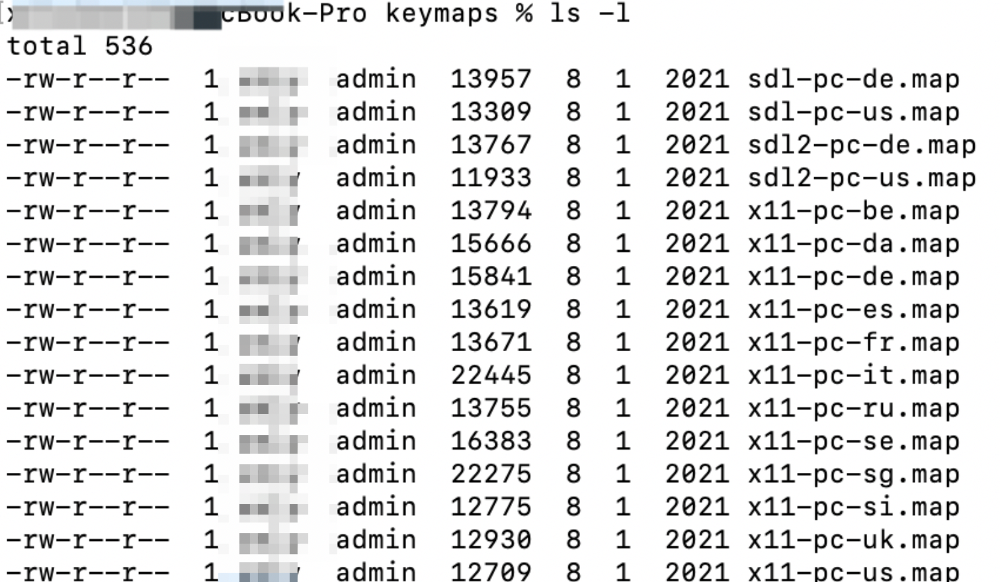
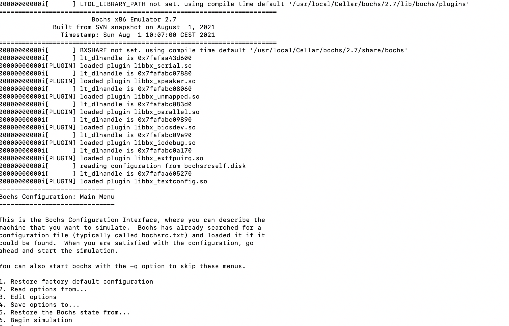
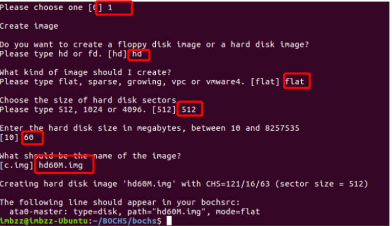
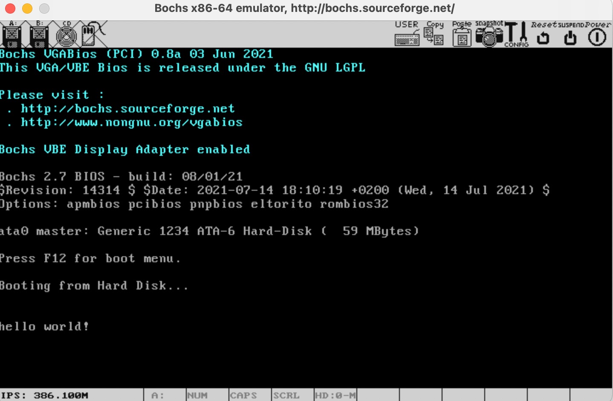

环境:macOs 11.2.3

软件:bochs 2.7

# bochs安装

在mac上安装bochs相对简单。直接brew install bochs即可。省去了书里提到的configure,make,make install 三步

### bochs配置

```
# Bochs启动配置文件
# 1.Bochs在运行中可使用的内存，设为32MB
megs: 32
# 2.设置对应真实机器的BIOS和VGA BIOS; 须为绝对路径，Bochs不识相对路径
romimage: file=/usr/local/Cellar/bochs/2.7/share/bochs/BIOS-bochs-latest
vgaromimage: file=/usr/local/Cellar/bochs/2.7/share/bochs/VGABIOS-lgpl-latest
# 3.选择启动盘符为硬件启动
boot: disk
# 4.日志输出
log: bochs.out
# 5.关闭鼠标，打开键盘
mouse: enabled=0
keyboard: keymap=/usr/local/Cellar/bochs/2.7/share/bochs/keymaps/sdl2-pc-us.map
# 6.硬盘设置
ata0: enabled=1, ioaddr1=0x1f0, ioaddr2=0x3f0, irq=14
#ata0-master: type=disk, path="/usr/local/Cellar/bochs/2.7/hd60M.img", mode=flat,cylinders=121, heads=16, spt=63
display_library: sdl2
```

保存为bochsrcself.disk

可能需要安装图形化界面。可以直接brew install sdl2

keyboard需要选择对应的项。比如sdl2对应sdl2-pc-us.map。具体可参考bochs/share/bochs/keymaps/ 路径下的配置如图
``


# 初次运行

bochs -f bochsrcself.disk



直接回车后输入c

首次打开会提示No bootable device

这是因为没有启动盘

所以需要创建一个启动盘

在bin目录下
``./bximage``

这里使用网图


启动盘命名为hd60M.img

创建启动盘后写一个asm文件helloworld

```    org 0x7c00
    jmp entry
    db 0x90
entry:
    mov ax,0
    mov ss,ax
    mov sp,0x7c00
    mov ds,ax
    mov es,ax
    mov si,msg
putloop:
    mov al,[si]
    add si,1
    cmp al,0
    je fin
    mov ah,0x0e
    mov bx,15
    int 0x10
    jmp putloop
fin:
    hlt
    jmp fin
msg:
    db 0x0a,0x0a
    db "hello world!"
    db 0x0a
    db 0
    times 510 - ($-$$) db 0
    dw 0xaa55

```

--这段mbr程序是参考网络的。汇编的知识已经早还给老师了。 刚看这段代码的时候 我看到

```
mov ax,0 
mov ss,ax
```

会去想 为什么不能直接mov ss 0呢?

chatgpt的回复:

```
在x86汇编中，使用mov指令来设置寄存器的值通常需要提供一个源操作数和一个目标操作数。虽然您可以将立即数（常数）作为源操作数，但是在设置ss寄存器的值时，通常使用mov ax, 0，然后再将ax的值移动到ss寄存器，而不是直接将常数0移动到ss寄存器。这是因为mov指令通常需要一个有效的内存地址或寄存器作为源操作数。

所以，下面的代码片段中：

mov ax, 0
mov ss, ax
这两条指令是为了将ss寄存器设置为0。第一条指令将0放入ax寄存器中，然后第二条指令将ax的值复制到ss寄存器。这是一种常见的设置段寄存器的方式。

如果您直接写成mov ss, 0，汇编器可能会报错，因为它需要一个有效的内存地址或寄存器作为源操作数，而不是一个常数。

总之，使用mov ax, 0来设置ss寄存器的值是一种常见的做法，它将0加载到ax寄存器，然后将ax的值复制到ss寄存器。
```

言归正传 我们已经完成了代码的编写。以及启动盘的创建和配置。现在是时候将asm文件编译为bin文件了

```
nasm mbr.asm -o mbr.bin
```

然后将bin文件写入到启动盘中即可

```
dd if=boot.bin of=hd60M.img bs=512 count=1 conv=botrunc
```

成功后重新启动bochs按c即可。helloworld


当你启动时报读hd60M的报错时。检查hd60M是否被其他占用。ls检查是否有hd60M.img.lock 。有的话删除即可

